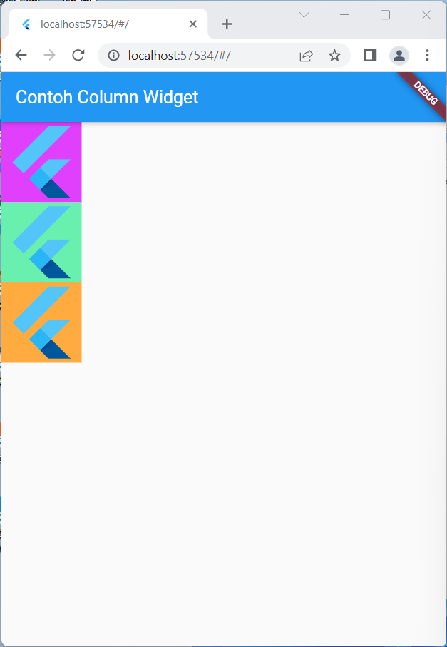
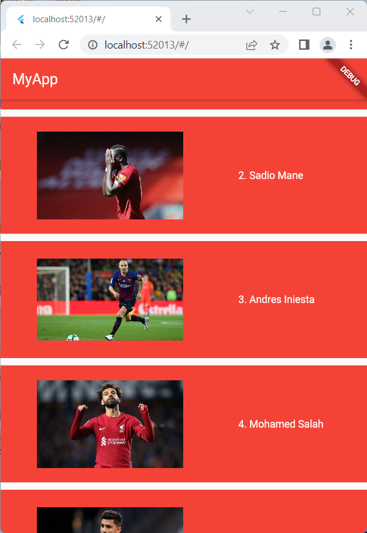

# basic_widget

<h3> Nama : Dewangga Putra</h3>
<h3> NIM : 2041720222 </h3>

<h3> Praktikum </h3>

<table>
  <tr>
    <th>Text Widget</th>
    <th>Image Widget</th>
    <th>Material Design dan iOS Cupertino </th>
  </tr>
  <tr>
    <td>
        
    </td>
    <td>
        
    </td>
    <td>
        
    </td>
  </tr>

  <tr>
    <th>Button</th>
    <th>Scaffold</th>
    <th>Dialog</th>
  </tr>
  <tr>
    <td>
        
    </td>
    <td>
        
    </td>
    <td>
        
    </td>
  </tr>

  <tr>
    <th>Input dan Selection Widget </th>
    <th>Date and Time Pickers </th>
    <th>Child Property</th>
  </tr>
  <tr>
    <td>
        
    </td>
    <td>
        
    </td>
    <td>
        
    </td>
  </tr>

</table>

<table>
  <tr>
    <th>Alignment Property</th>
    <th>Color Property</th>
    <th>Height and Width Property</th>
  </tr>
  <tr>
    <td>
        
    </td>
    <td>
        
    </td>
    <td>
        
    </td>
  </tr>

  <tr>
    <th>Margin Property</th>
    <th>Padding Property</th>
    <th>Transform Property</th>
  </tr>
  <tr>
    <td>
        
    </td>
    <td>
        
    </td>
    <td>
        
    </td>
  </tr>

  <tr>
    <th>Decoration Property</th>
    <th>Column Widget</th>
    <th>Row Widget</th>
  </tr>
  <tr>
    <td>
        
    </td>
    <td>
        
    </td>
    <td>
        
    </td>
  </tr>

</table>

<table>
  <tr>
    <th>Stack</th>
    <th>ListView</th>
    <th>GridView </th>
  </tr>
  <tr>
    <td>
        
    </td>
    <td>
        
    </td>
    <td>
        
    </td>
  </tr>

</table>

<h3> Tugas </h3>

<table>
  <tr>
    <th>Screenshot 1</th>
    <th>Screenshot 2</th>
  </tr>
  <tr>
    <td>
        
    </td>
    <td>
        
    </td>
  </tr>

</table>

